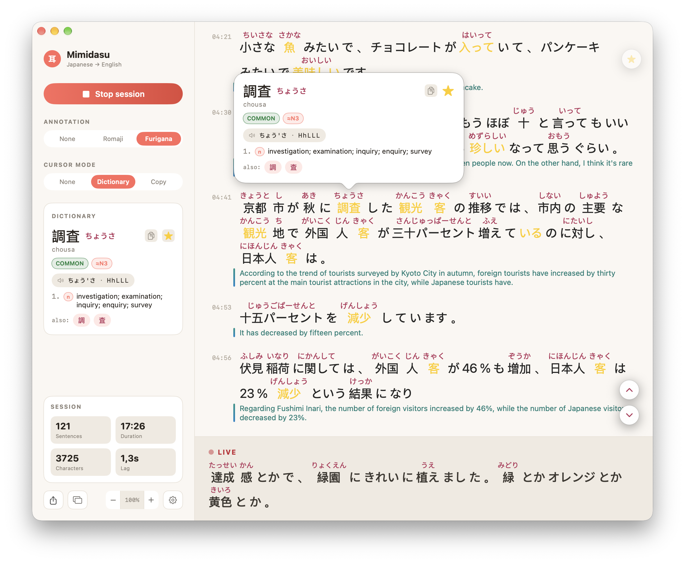

# Mimidasu

**Live translated subtitles for anything Japanese on your Mac.**

Mimidasu listens to whatever your Mac is playing — a livestream, a video, a
voice chat — and turns the Japanese speech into translated subtitles in real
time. No accounts, no uploads, no cloud: everything runs on your machine.

**The name is a pun.** 見出す (*miidasu*) is Japanese for "to spot, to
discover." Add one more ミ and the word gains an 耳 (*mimi*, ear): **ミミダス**
— *the ear that surfaces words*. Exactly what the app does; it even works as
a verb, because every definition popup is a little *mimidasu*.

<p align="center">
  
</p>

## Level-up your Japanese listening

- **Understand while it happens** — sentences appear as they're spoken, with
  the translation right under the Japanese
- **Pick your translation language** — English by default, with 18 more
  targets (Chinese, Korean, Spanish, French, …) available in Settings, all
  on-device via Apple's Translation framework
- **Private by design** — audio, transcription, and translation all stay
  on-device; nothing ever leaves your Mac unless you opt into a cloud
  translation provider
- **Learn as you watch** — toggle furigana or romaji over the transcript, and
  click any word for definitions, pitch accent, and JLPT level
- **Add favorites, spot them in the wild** — favorite words appear
  amber-colored in the transcript, inflected forms included (見る also
  highlights 見た and 見ます), so keep an eye out for them in the transcript!
- **Floating subtitles** — a click-through HUD overlays the video you're
  watching, so Mimidasu stays out of the way
- **Keep the transcript** — export any session as TXT, SRT, VTT, or JSON

## Requirements

- Apple Silicon Mac, macOS 15.5+

## Quick start (from source)

```bash
scripts/bootstrap.sh      # one-time setup
brew install cmake ninja  # build dependencies
scripts/build_all.sh      # builds the ASR runtime, tokenizer, and dictionaries
open Mimidasu.xcodeproj   # then ⌘R
```

On first launch you pick a speech model and it downloads automatically; press
**Start** and grant audio access when prompted.

## Development

- `scripts/test.sh` — tests + coverage (Swift Testing)
- `scripts/lint.sh` — swiftformat + swiftlint
- See `ARCHITECTURE.md` for design notes

## Support Mimidasu 💛

Mimidasu is a labor of love — every feature is free. I built this because I
couldn't find anything like this that is completely free. If Mimidasu makes
your Japanese learning, listening, or content workflow easier, please consider
sponsoring the project. Every contribution — big or small — helps keep
the project alive, free, and improving.

## License

Mimidasu is Copyright (C) 2026 Aulia Sufian Adi.

- **Source code** (and any build distributed outside the Mac App Store):
  [GNU AGPL-3.0](LICENSE.md)
- **Mac App Store build**: governed by Apple's standard Licensed
  Application EULA — see [LICENSE-MAS.md](LICENSE-MAS.md)

Third-party components are documented in
[THIRD_PARTY_NOTICES.md](THIRD_PARTY_NOTICES.md).
